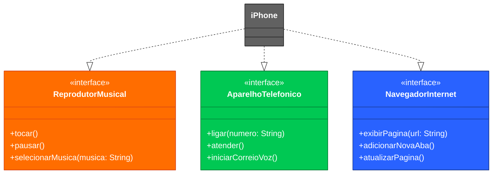

# dio-trilha-java-basico-UML

```mermaid
classDiagram
    %% Interfaces
    class ReprodutorMusical {
        <<interface>>
        +tocar()
        +pausar()
        +selecionarMusica(musica: String)
    }
    
    class AparelhoTelefonico {
        <<interface>>
        +ligar(numero: String)
        +atender()
        +iniciarCorreioVoz()
    }
    
    class NavegadorInternet {
        <<interface>>
        +exibirPagina(url: String)
        +adicionarNovaAba()
        +atualizarPagina()
    }
    
    %% Classe concreta
    class iPhone {
    }
    
    %% Conexões de realização
    iPhone ..|> ReprodutorMusical
    iPhone ..|> AparelhoTelefonico
    iPhone ..|> NavegadorInternet
    
    %% Estilização
    style ReprodutorMusical fill:#FF6D00, stroke:#D84315, color:#FFFFFF
    style AparelhoTelefonico fill:#00C853, stroke:#007A33, color:#FFFFFF
    style NavegadorInternet fill:#2962FF, stroke:#163487, color:#FFFFFF
    style iPhone fill:#616161, stroke:#212121, color:#FFFFFF
```
